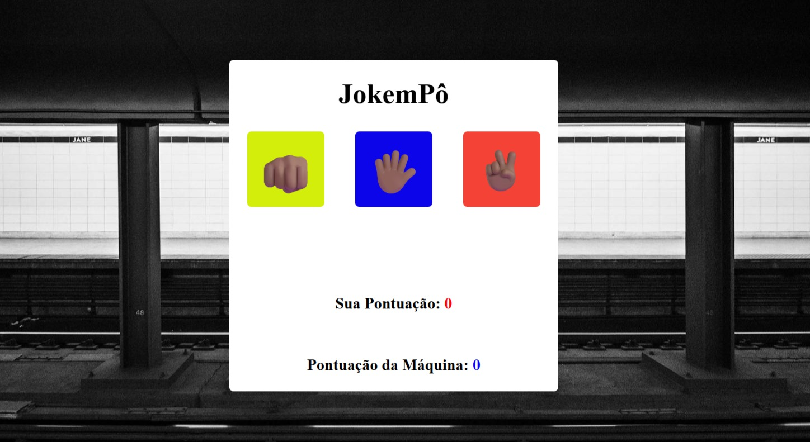

# 🎮 Jokenpô

Um jogo de **Pedra, Papel e Tesoura** desenvolvido com **HTML, CSS e JavaScript**, onde o usuário joga contra a máquina.

## 🚀 Tecnologias utilizadas

- HTML5
- CSS3
- JavaScript (ES6)

## 📋 Funcionalidades

- ✊ Escolha entre Pedra, Papel ou Tesoura.
- 🤖 A máquina faz uma escolha aleatória.
- 🏆 Verifica vitória, derrota ou empate.
- 📊 Atualiza a pontuação do jogador e da máquina em tempo real.
- 💻 Interface simples e responsiva.

## 📁 Estrutura do projeto

```
📦 Jokenpo
├── index.html
├── style.css
├── script.js
└── README.md
```

## ▶️ Como executar

1. Clone este repositório:

```bash
git clone https://aleblack25.github.io/projeto_function_jokenp-/
```

2. Abra a pasta do projeto.

3. Abra o arquivo `index.html` no navegador ou utilize a extensão **Live Server** do VS Code.

## 📸 Demonstração





## 🎯 Aprendizados

Durante o desenvolvimento deste projeto foram praticados conceitos como:

- Manipulação do DOM
- Eventos (`onclick`)
- Funções
- Arrow Functions
- Condicionais (`if`, `else if`, `else`)
- Operadores lógicos (`&&` e `||`)
- Arrays
- Geração de números aleatórios com `Math.random()`
- Atualização dinâmica de elementos HTML

## 🔮 Melhorias futuras

- Adicionar botão de reiniciar partida.
- Mostrar a escolha da máquina com emojis.
- Encerrar o jogo ao atingir uma pontuação definida.
- Adicionar animações durante cada rodada.
- Melhorar a responsividade para dispositivos móveis.

## 👨‍💻 Autor

**Alexandre Costa**

GitHub: https://github.com/aleblack25
LinkedIn: www.linkedin.com/in/alexandre-costa-dev
